# SPRING MICROSERVICES FULL

### 1. Part-1 : Base service
- Init base service : Product Service, Order Service, Inventory Service

### 2. Part-2 : Communicate service
### 3. Part-3 : Service Discovery
### 4. Part-4 : Api gateway
### 5. Part-5 : Security keycloak

```shell
 docker run -p 8181:8080 -e KEYCLOAK_ADMIN=admin -e KEYCLOAK_ADMIN_PASSWORD=admin quay.io/keycloak/keycloak:18.0.0 start-dev
```
- Truy cập url : localhost:8181
- Đăng nhập keycloack
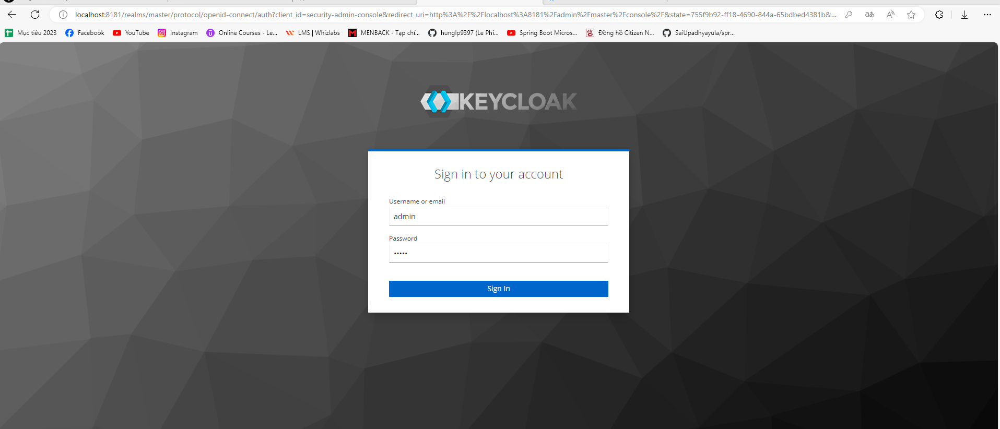
- Tạo realm:
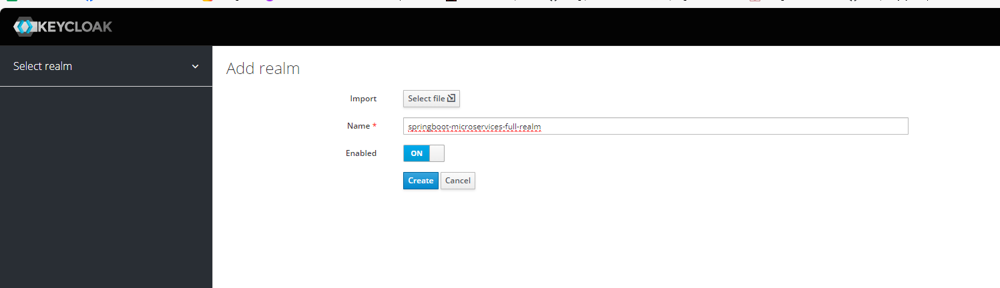
- Tạo client với tên : spring-cloud-client
  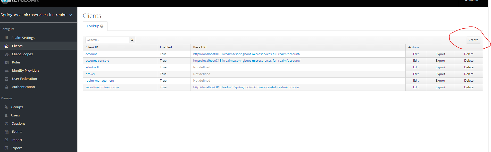
- Setting client như sau:
  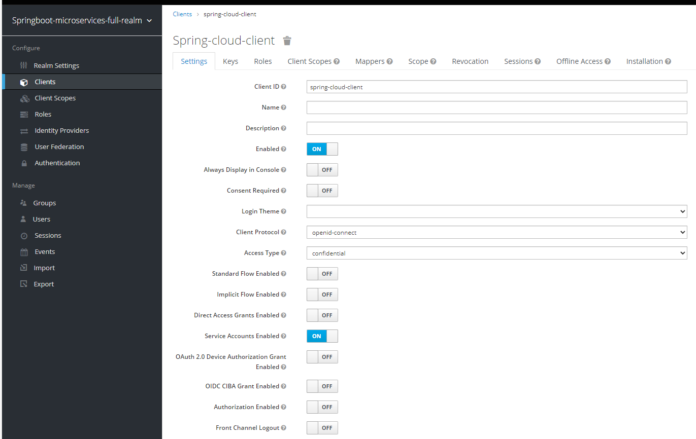
- Sau khi save setting client. Tại tab Credentials, copy giá trị secret: zF3mUlEVRk7FFIocet3py6u98R3TxGAi
  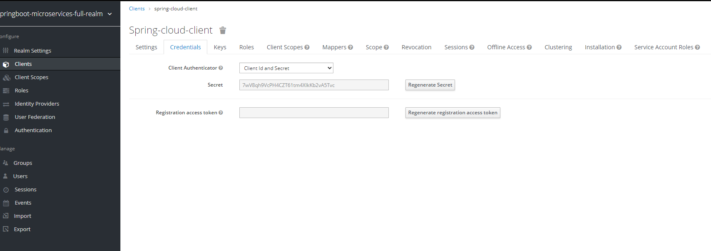
- Tại Realme settings, Tại mục endPoints, bấm vào link OpenID Endpoint Configuration
  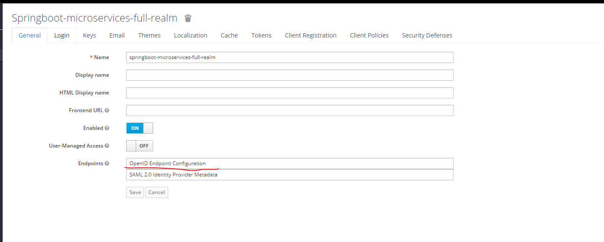
- Copy giá trị issuer paste vào applications.properties của api-gateway
  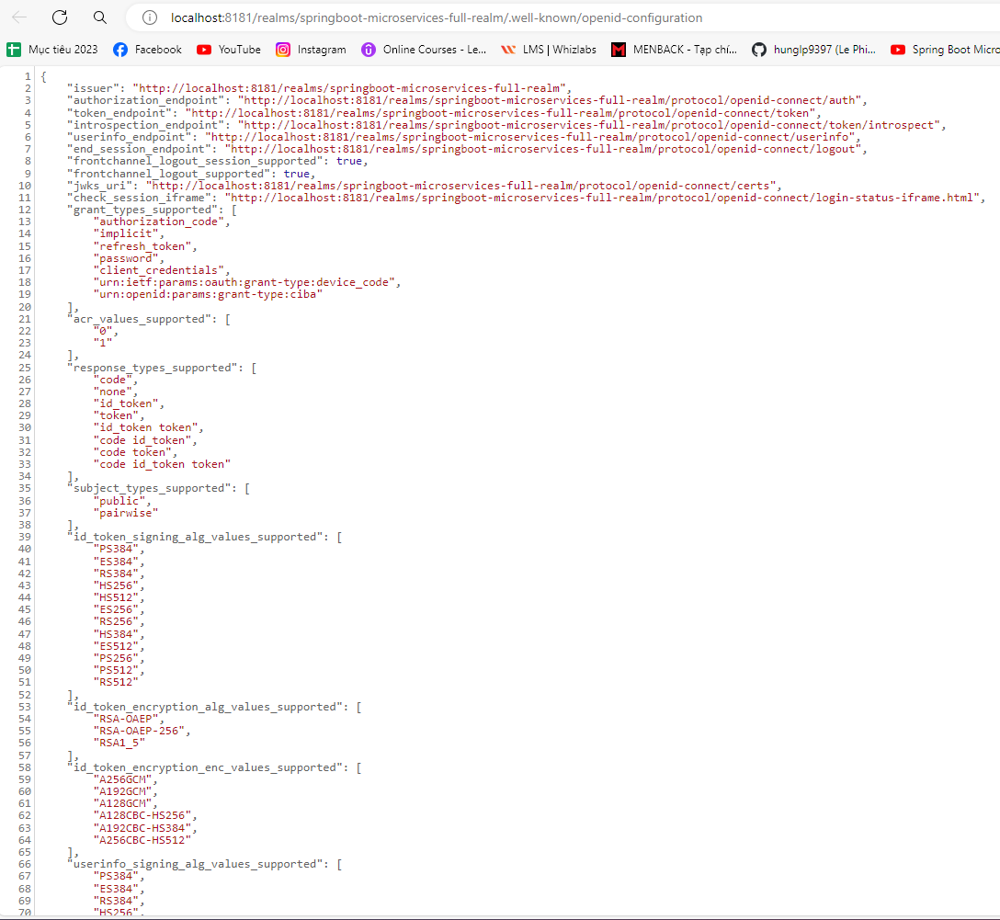
```java
    spring.security.oauth2.resourceserver.jwt.issuer-uri=http://localhost:8181/realms/springboot-microservices-full-realm
```

- Test Authen của api:
   + Gọi api get all product thông qua api gateway:
     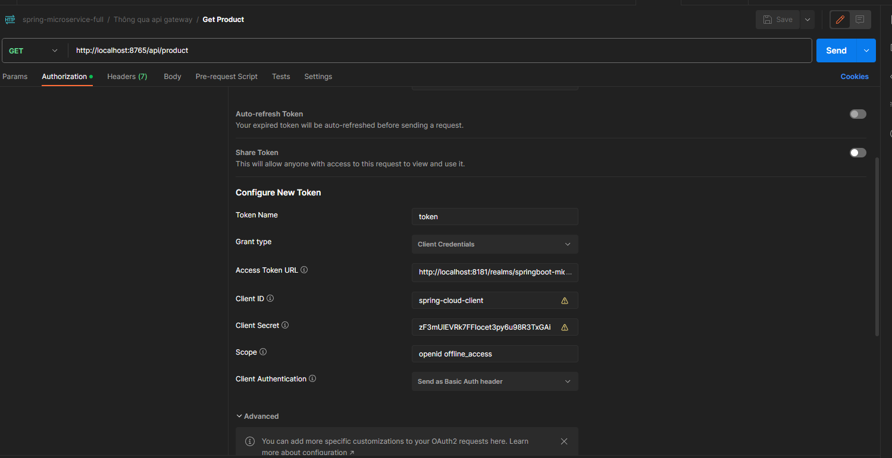
     Trong hình trên thì giá trị của accces-token-url là : http://localhost:8181/realms/springboot-microservices-full-realm/protocol/openid-connect/token
   +  Authen thành công:
      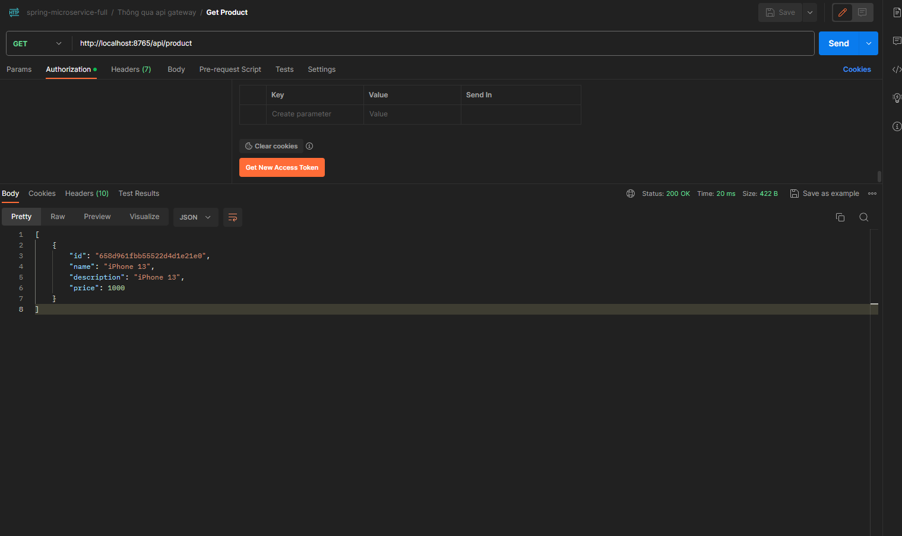
      ( Lưu ý : Khi bị Unauthorized(sau 300ms) thì bấm vào "Get new acccess token" Rồi sau đó "Use token" để refresh lại access_token để dùng lại )
   +  Một ví dụ khác, TEST api Create Order thông qua api-gateway
        + Trường hợp ko dùng authen:
          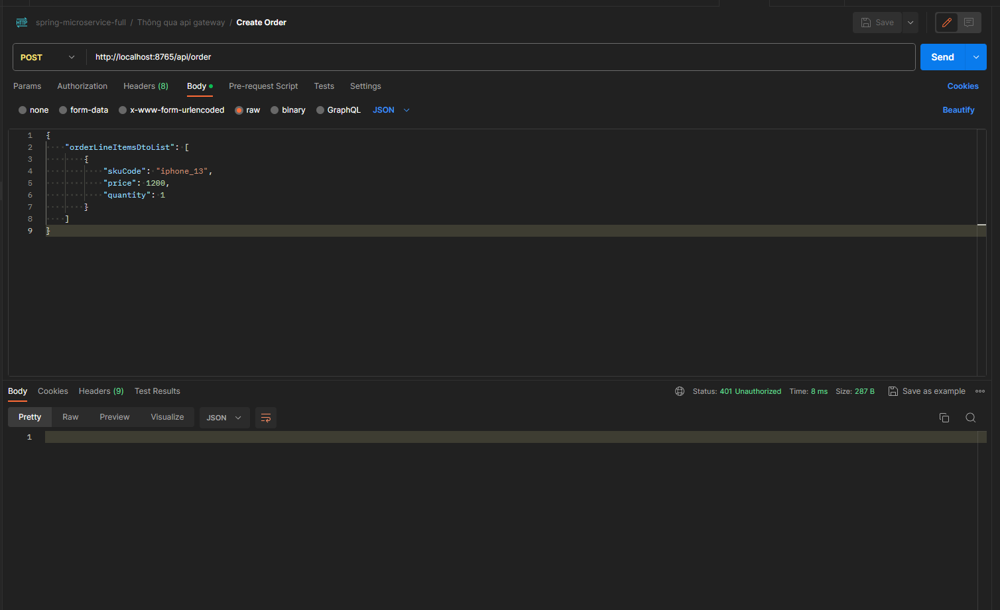
        +  Khi authen token, tạo order thành công:
           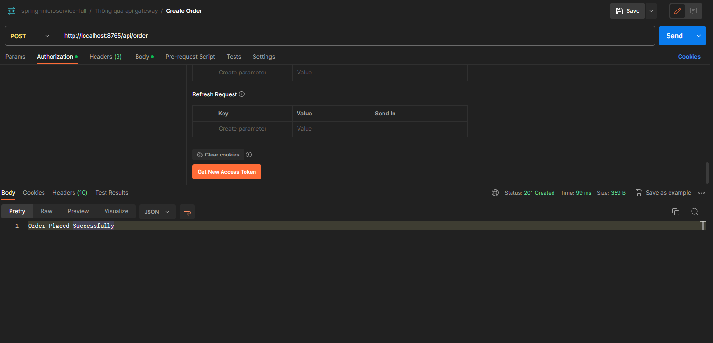